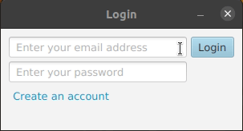
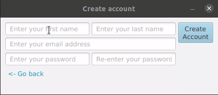
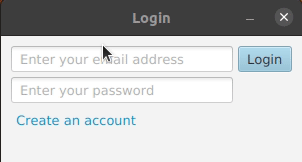
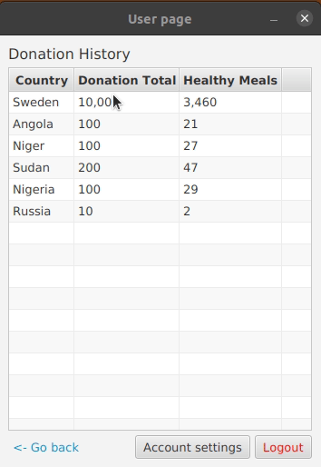
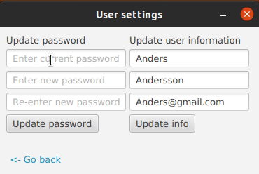

## Table of Contents
* [General Info](#general-information)
* [Technologies Used](#technologies-used)
* [Features](#features)
* [Screenshots](#screenshots)
* [Setup](#setup)
* [Project Status](#project-status)
<!-- * [License](#license) -->

## General Information
- This project was part of a agile software development course
- We aimed at affecting one of FN global goals (poverty and hunger)
- The application creates an overview of how many people are living in poverty and how much a donation would help

## Technologies Used
- Java - version 1.8
- JavaFx

## Features
List the ready features here:
- Create user and login
- Keep track of donation data about each user
- Interactive heatmap
- User settings
- View donation history

## Screenshots

<!-- If you have screenshots you'd like to share, include them here. -->

## Setup

## Project Status
Project is: no longer being worked on.

